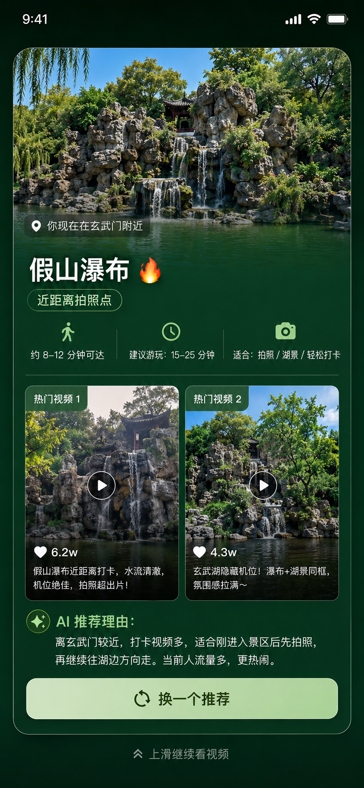

# 即刻打卡：下一站去哪

<p align="center">
  
  
  
</p>

> 抖音信息流 AI 原生卡片体验 Demo

本项目聚焦“景区游玩中的下一站智能推荐”场景，围绕 LBS 与 AI 能力，模拟一张自然融入短视频信息流的互动卡片。当用户身处特定景区打卡点时，系统结合当前位置、实时环境与用户偏好，给出即时、低交互成本的游玩建议，帮助用户更轻松地完成下一步决策。

## 项目简介

“即刻打卡：下一站去哪”不是一个需要用户主动寻找和打开的工具，而是一种在合适场景下自然出现的智能伴游体验。它希望在用户刷视频的沉浸状态里，用一张高价值卡片完成信息传递、路线推荐与互动转化。

典型使用场景包括：

- 用户在景区游玩途中短暂休息时刷视频
- 系统识别用户所在核心景点位置
- 卡片展示当前锚点信息与热门内容
- AI 给出下一站推荐和简要行动建议
- 用户一键执行导航、收藏路线或继续探索

## 核心功能

- 场景化无感触发：基于位置识别，在合适的景点节点触发推荐卡片
- 当前锚点聚合：展示用户当前所在景点及相关热门打卡内容
- AI 下一站推荐：结合多维信息生成更贴合当下情境的游玩建议
- 智能摘要辅助：用更易理解的方式输出路线与游玩提示
- 轻量交互闭环：支持快速查看、切换和继续下一步操作

## 产品价值

- 对用户：降低做攻略成本，减少陌生景区中的选择负担
- 对景区与内容生态：帮助优质打卡内容与位置场景产生更强连接
- 对平台：探索线上内容消费与线下空间行为结合的互动方式

## 本地运行

### 环境要求

- Node.js
- npm

### 安装依赖

```bash
npm install
```

### 启动开发环境

```bash
npm run dev
```

启动后可在本地开发地址中查看项目效果。

## 系统构建操作

### 生产构建

```bash
npm run build
```

该命令会生成可部署的构建产物。

### 本地预览构建结果

```bash
npm run preview
```

### 类型检查

```bash
npm run lint
```

当前该命令用于执行 TypeScript 类型检查。

## 项目说明

- 本仓库当前主要用于产品交互体验演示
- README 内容以根目录中的 `产品介绍.md` 为主要依据整理
- 本文档侧重产品说明、运行方式和构建操作，不展开项目代码架构

## 开源协议

本项目基于 [Apache License 2.0](http://www.apache.org/licenses/LICENSE-2.0) 开源发布。

你可以在遵守协议条款的前提下使用、修改和分发本项目代码。
